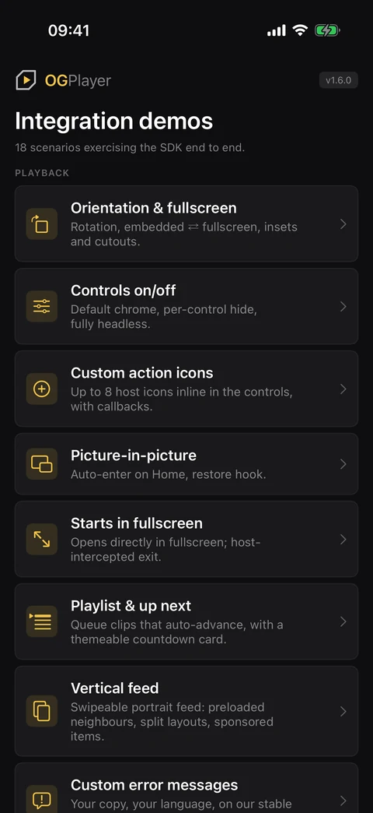
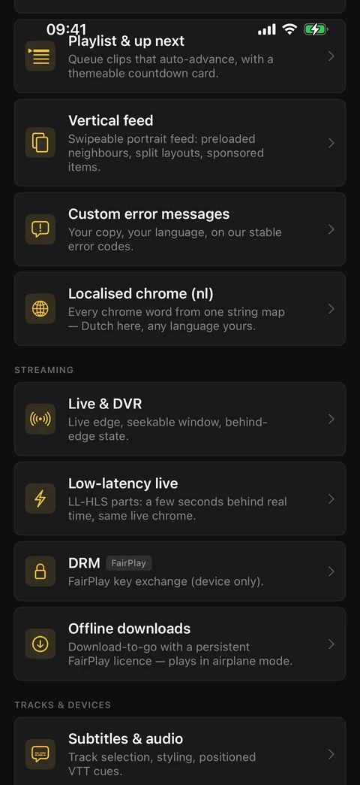
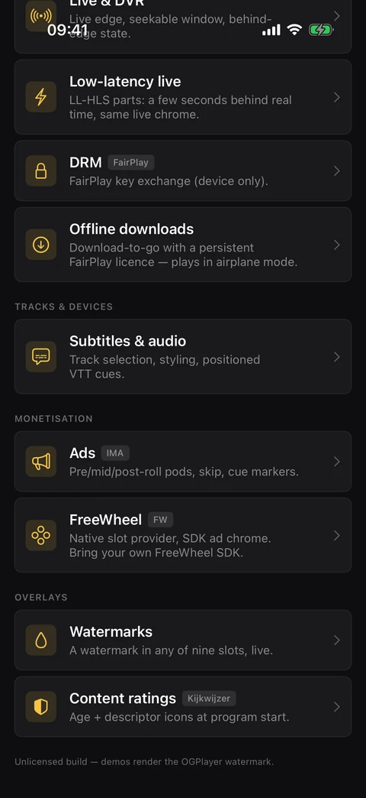
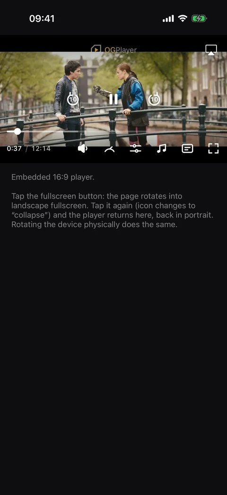
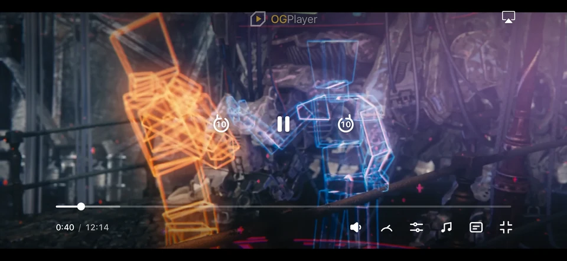
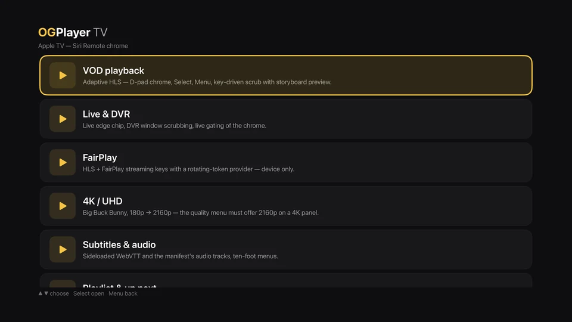
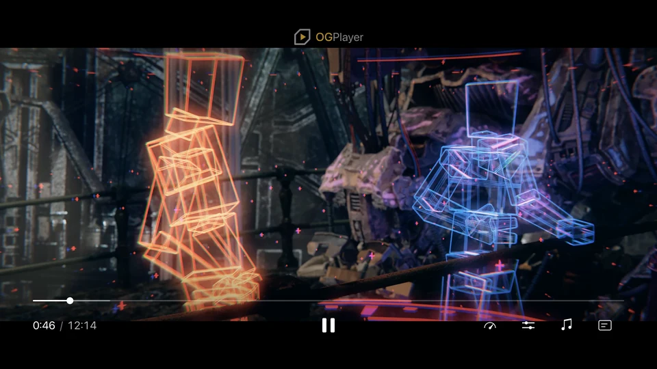

# OGPlayer — iOS demo app

Integration demos for the [OGPlayer](https://ogplayer.tv) iOS SDK: VOD,
live & DVR, low-latency live (LL-HLS, a few seconds behind real time),
FairPlay DRM, Google IMA ads, subtitles & audio tracks, AirPlay, content
ratings, watermarks, custom error handling, localised chrome (every control
label, menu row and message from one strings map) — each demo is a small,
readable SwiftUI screen you can lift code from. The project also carries the
Apple TV demo (see below).

## Screenshots

<p>
  
  
  
</p>
<p>
  
  
</p>

Apple TV:

<p>
  
  
</p>

## Run it

Open `OGPlayerDemos.xcodeproj` in Xcode and press Run. The SDK resolves from
Swift Package Manager automatically:

```
https://github.com/ogplayer-sdk/ogplayer-swift
```

Requires iOS 18+ · Xcode 16+. For a physical device, select your signing
team (Signing & Capabilities), or regenerate the project with
`DEVELOPMENT_TEAM=<your team id> xcodegen generate`.

Docs: https://ogplayer.tv/docs · Live web demo: https://demo.ogplayer.tv

## On Apple TV

Select the `OGPlayerDemosTV` scheme and an Apple TV simulator (or a
dev-signed Apple TV) and press Run: a TV launcher with the scenarios on the
SDK's Siri Remote chrome — VOD, live & DVR, FairPlay (device only),
subtitles & audio (including positioned cues), playlists with
previous/next, Google IMA ads through the tvOS IMA product, content
ratings, custom actions and the error overlay. Requires tvOS 18+. A scenario
can be opened directly on the simulator:

```sh
SIMCTL_CHILD_OG_DEMO=vod xcrun simctl launch booted com.ogplayer.demos.tv
```

On tvOS the remote chrome is the chrome — nothing to switch on. Guide:
https://ogplayer.tv/docs/getting-started/apple-tv/

## Notes

- **FreeWheel:** FreeWheel's AdManager SDK is licensed to FreeWheel
  customers and not bundled — the FreeWheel demo shows setup steps until
  you add your `AdManager.framework` to the project and fill in
  `Sources/DemoFwConfig.swift`. The OGPlayer adapter it uses is vendored in
  `FreeWheelAdapter/` (the canonical copy ships with the SDK package).
- **Licensing:** this demo code is MIT. The OGPlayer SDK itself is a
  commercial product — free to evaluate with a watermark; production use
  requires a license. See https://ogplayer.tv/terms/
- **Read-only repository:** issues and pull requests are closed —
  questions and reports are welcome at hello@ogplayer.tv.

Demo content: Tears of Steel — (CC) Blender Foundation · mango.blender.org
